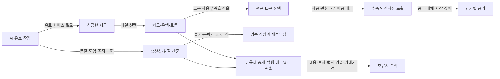

# 화폐·달러·스테이블코인·AI 경제: 독립 연구 결과

상태: **COMPLETED_WITH_LIMITATIONS**. 검색·열람일 2026-09-21 KST. 시장 원자료는 최대 2026-09-18까지이며 시계열별 끝점은 다르다. 비교용 완결 표본은 2017–2025년, 2026년은 8월까지 별도다. R0–R5를 수행했으며, 작성자 자기검토만 받았다. 개별 주장 입증과 연구 업무 완료를 구분한다.

**디지털 결제와 AI는 화폐를 없애기보다 접근·권한·정산·가치 귀속을 재배치한다. 그러나 AI 사용 증가가 스테이블코인 잔액, 순증 국채 수요, 장기금리 하락, 위험자산 상승으로 이어지는 필연적 연쇄는 확인되지 않았다.** 연결마다 다른 자료와 식별이 필요하다. 이번 연구에서 가장 강한 근거는 회계 관계, 법률·프로토콜의 특정 규칙, 공개 공시의 산술이다. 금리·생산성 인과는 연구의 가정과 표본에 조건부이며, 독립적인 에이전트 상업 실적은 특히 부족하다.

## 판단을 바꾼 결과

| 판단 | 실제 근거 | 적용 범위와 한계 |
|---|---|---|
| 스테이블코인 발행은 국채 순증 수요와 같지 않다 | 발행사 준비자산 대조, T01 원장, T03 대체 시나리오 | 기존 MMF·직접 국채·예금의 이동 원천을 알아야 순증을 추정할 수 있다 |
| 단기국채 금리 하락 효과는 조건부로 지지된다 | BIS1270 June2026, IMF WP26/44 | 다른 충격 단위·표본·식별; 장기금리 효과는 약하거나 유의하지 않다 |
| 달러의 국내 구매력과 대외 환율은 반대로 움직일 수 있다 | 2022 미국 CPI +6.40%, broad dollar +5.33% | 연말 대비, 수정된 현재 빈티지; 국제사용 비중은 별도 지표 |
| 비트코인의 공급 제약은 안정적 헤지 성과를 보장하지 않는다 | 2022 BTC USD −64.25%, 미국 실질 −66.40%; T04 | 특정 위기 반례이지 모든 기간의 분산효과를 부정하지 않는다 |
| 에이전트는 반드시 퍼블릭체인으로 지급할 필요가 없다 | AP2 카드·x402 구조, 총비용 민감도 | 상용 총비용 우열은 아직 실측하지 못했다 |
| AI 생산성은 이질적이다 | 고객지원 개선, 기업 개발자 실험 개선, METR 초기 숙련 개발자 지연 | 과업·도구·숙련·채택·품질이 달라 효과를 평균하면 안 된다 |
| 이용·투자 증가와 자산 보유자 이익은 다르다 | Circle Q2 비용 차감, Microsoft FY 현금흐름 대조 | 전체 기업 수치와 AI 전용 수익률·토큰 권리를 혼동하지 않는다 |

아래 S/D 번호는 [자료 원장](SOURCES.jsonl), H 번호는 [가설 원장](CLAIMS.jsonl), T 번호는 [분석·검토 기록](ANALYSIS_AND_REVIEW.md)에 연결된다. 단순 발견, 초록, 본문 일부, 방법·결과 분석, 데이터 계산을 구분했다. 모든 논문을 전면 정독했다는 주장은 하지 않는다.

## A. 화폐의 신뢰와 역사 — H01–H04

현대 은행의 대출은 차입자의 예금을 만들어 내지만, 지급에 필요한 은행 간 준비금과 규제·자금조달 제약은 별도다. 희소한 물건만 화폐가 되는 것도, 모든 화폐가 동일한 법적 청구권인 것도 아니다. 무엇을 계산단위로 쓰는지, 무엇을 이전하는지, 최종적으로 누구의 부채로 결제되는지를 나누는 설명이 더 정확하다. [BoE의 현대 화폐·은행 설명, S01–S02](https://www.bankofengland.co.uk/quarterly-bulletin/2014/q1/money-creation-in-the-modern-economy).

역사에서도 하나의 선형 단계는 부적절하다. Amsterdam 은행은 1683년 예금의 일반적인 금속 상환을 없애면서도 별도의 금속 receipt 제도를 운영했다. 계정화폐·금속·조건부 교환권이 함께 존재한 사례다. 해당 연구는 충분한 재정적 뒷받침과 거버넌스의 중요성을 모형화하지만, 현대 중앙은행과 스테이블코인이 동등한 기관이라는 증명은 아니다. [BIS1065, S48, 역사 부분 PDF pp7–10](https://www.bis.org/publications/working-paper-1065-bank-amsterdam-and-limits-fiat-money.pdf). 기원전 약1646년 은 대출을 기록한 박물관 소장품도 신용 기록의 오랜 존재를 보여준다. 그 하나로 모든 사회의 화폐 기원이나 물물교환의 부재를 단정하지 않는다. [Met 소장품86.11.224, S49](https://www.metmuseum.org/art/collection/search/321802).

따라서 신뢰는 발행사·수탁자·검증자·오라클·업그레이드 권한·법적 집행으로 나누어 조사해야 한다. 코드가 외부 자산의 존재나 실제 배송을 스스로 보증하지는 않는다. 실제 통제권을 계량하려면 키 보유자, 거부·동결권, 검증자 집중도, 업그레이드 절차를 별도로 조사해야 하며 이번에는 그 패널을 만들지 않았다. [Ethereum oracle problem, S17](https://ethereum.org/developers/docs/oracles/).

## B. 부채·달러·유동성 — H05–H08

달러의 세 축은 **미국 내 구매력**, **다른 통화 대비 가격**, **국제 거래·부채·준비자산에서의 사용**이다. 2022년 CPI와 broad dollar가 모두 오른 것은 앞의 두 축이 서로 다를 수 있음을 보여준다(T04). Fed의 2025년판은 2024년 외환보유액의 달러 비중을 약58%로 보고한다. 이것은 금을 포함한 모든 준비자산 비중이나 2026년 수치가 아니다. 2026년판을 확인하지 못했으므로 최신값처럼 앞당기지 않았다. [S03](https://www.federalreserve.gov/econres/notes/feds-notes/the-international-role-of-the-u-s-dollar-2025-edition-20250718.html).

부채는 다음 회계식에서 출발했다.

`b_t = ((1+i_t)/(1+g_t)) × b_(t−1) + d_t + sfa_t`

`b`는 GDP 대비 부채, `i`는 기존 부채의 평균 명목 조달금리, `g`는 명목 GDP 성장률, `d`는 GDP 대비 기초적자다. 아래는 `b0=100%`, `d=2%`, `sfa=0`인 **가상 10년 민감도**이며 미국 전망이 아니다.

| 평균 금리 / 명목 성장 | 10년 뒤 부채/GDP |
|---|---:|
| 2.5% / 5.5% | 92.57% |
| 4.0% / 4.0% | 120.00% |
| 5.5% / 2.5% | 156.29% |

성장률보다 낮은 금리는 부담을 줄일 수 있지만 적자·위험 프리미엄·성장 자체가 고정되어 있지 않다. 안전금리와 자본의 위험수익률도 다르다. 낮은 안전금리가 무제한 차입이나 후생비용 부재를 뜻하지 않는다는 반론을 보존했다. [Blanchard2019, S34](https://www.piie.com/sites/default/files/documents/wp19-4.pdf). T02에서는 차환 비율을 10%·25%·100%로 달리하여 금리 하락의 평균 조달금리 반영 시차도 계산했다.

T01의 바이백 비교에서 기존 TGA 잔액을 쓰면 연준의 자산은 그대로이고 부채가 TGA에서 준비금으로 옮겨간다. 비은행이 신규 국채를 산 자금으로 바이백을 하면 앞선 준비금 감소와 뒤의 증가가 상쇄될 수 있다. QE는 연준 자산과 준비금이 함께 늘어나는 거래다. 거래상대방·RRP 이용 여부·시점 차이를 바꾸면 경로도 달라진다. 국채 바이백은 현금관리·시장 유동성 지원 프로그램이며 그 명칭 자체가 통화완화를 뜻하지 않는다. [Treasury FAQ, S32](https://www.treasurydirect.gov/help-center/faqs/buyback-faqs/). 2026-08-19의 매입한도 변경 발표도 실제 체결량과 구분했다. [S33](https://home.treasury.gov/news/press-releases/sb0607).

`연준 자산−TGA−ON RRP`를 자산가격의 보편식으로 채택하지 않았다. 이번 원장은 거래의 회계 검증이며, 실제 QT·레포·RRP·국채 발행을 함께 추정한 유동성 시계열 분석은 미수행이다.

## C. 스테이블코인 준비자산과 순증 수요 — H09–H12

동일 기준일인 2026-06-30의 보고서를 맞춰 비교했다. 아래는 **미국 달러 십억(billion)** 단위이며 서로 배타적인 항목으로 합산했다. 펀드 총액을 내부 국채·레포와 다시 더하지 않았다.

| 구성 | Circle USDC 준비금 | Tether 보고 자산 |
|---|---:|---:|
| 미국 국채 증권 / bills | 8.524 | 114.961 |
| overnight Treasury repo / reverse repo | 52.527 | 18.626 |
| term reverse repo | 별도 없음 | 6.993 |
| 현금·순결제·기타 자산 | 12.294 | 나머지47.171 |
| 총액 | 73.345 | 187.751 |
| 해당 토큰 / 토큰 관련 부채 | 73.269 | 183.622 |

Circle 준비금의 약11.62%는 펀드 내부 국채 증권, 71.62%는 overnight Treasury repo다. repo 담보와 국채 직접 소유는 같은 항목이 아니다. Tether 자산 중 직접 미국 bills는 약61.23%이며 금·BTC·대출 등도 있다. term repo 담보 전체가 미국 국채인지 문구만으로 확정하지 않았다. 양 보고서는 특정 주장에 대한 외부 확인업무이고 발행사 전체의 재무제표 감사나 매 순간의 유동성 보장은 아니다. [Circle June 보고서, S29](https://6778953.fs1.hubspotusercontent-na1.net/hubfs/6778953/USDCAttestationReports/2026/2026%20USDC_Examination%20Report%20June%2026.pdf), [Tether June 보고서, S30](https://assets.ctfassets.net/vyse88cgwfbl/2kYf7r64h3tzwiu6F0CbUB/2997abd2f11ecea74a21528048b50707/Opinion___Report_-_Tether_International_Financial_Figure_30-06-2026.pdf).

발행사 보유액은 **저량**, 매입·상환은 **유량**, 글로벌 순증 수요는 **반사실과 비교한 변화**다. 예금이 발행사나 국채 매도자의 예금으로 재배치될 수 있고 MMF의 기존 국채 수요를 대체할 수도 있다. [Fed 은행·스테이블코인 경로 분석, S36](https://www.federalreserve.gov/econres/notes/feds-notes/banks-in-the-age-of-stablecoins-implications-for-deposits-credit-and-financial-intermediation-20251217.html). T03의 가상 발행 증가100B에 준비금 국채 배분0.5/0.9와 이전 국채 노출0/0.5/1을 조합하면 순노출 변화는 −50B부터+90B까지 달라진다. 이는 추정 범위가 아니라 가정의 중요성을 보이는 예다. 실제 순증 규모 H10은 보류했다.

금리 문헌은 서로 다른 방법의 결과를 구분했다.

| 원연구와 판본 | 충격과 표본 | 보고된 결과 | 핵심 제약 |
|---|---|---|---|
| BIS1270, June2026개정 | 2021-01~2026-03, 7개 토큰·117개 체인 자료; 5일 유입3.5B | 3개월물 당일 약−0.71bp; 약10일 후−4bp, 13일 부근−5bp | granular IV의 배제 제약; 체인 이동·공통 충격; 긴 만기 전파 제한 |
| IMF WP26/44, March2026 | 2019-01~2025-06 USDC/USDT; 시총1% 충격 | 일간 1개월−0.423bp, 3개월−0.498bp; 1년·10년 유의하지 않음 | 사건 선택, 사건/비사건 충격 분산 가정, 규제뉴스의 직접효과 |

두 논문은 단기 안전자산 수요 경로를 지지하지만 충격 단위와 표본이 달라 계수를 평균하거나 상호 배수로 환산하지 않았다. IMF는 동적 주식·크립토 파급도 보고하므로 “위험자산 전파가 전혀 없다”는 결론 역시 부적절하다. 다만 그 결과가 AI에서 시작하는 전체 연결을 식별한 것은 아니다. 같은 시장을 관찰한 별도 연구 두 개이지 완전히 독립된 두 시장 실험도 아니다. [BIS S07](https://www.bis.org/publications/working-paper-1270-stablecoins-and-safe-asset-prices.pdf), [IMF S37](https://www.imf.org/-/media/files/publications/wp/2026/english/wpiea2026044-source-pdf.pdf).

결제 잔액의 간단한 사고 도구는 `B≈P/v`다. 연간 결제1B, 회전12회이면 약83.33M이다. 결제2B와 회전24회도 같다(T07). 저축·담보·예방적 잔액은 별도다. 온체인 총전송을 실물 결제액으로 넣어 회전율을 정밀 계산하지 않았다.

## D. 상환·법적 권리·다른 화폐 — H13–H16

| 구조 | 어떤 약속·장치인가 | 별도로 확인할 실패 경로 |
|---|---|---|
| USDC/USDT형 | 준비자산과 발행사 상환 구조 | 자산 손실, 현금화, 은행·수탁, 직접 상환 자격·대기 |
| Sky 담보·PSM 구조 | 담보 청산·오라클·유동성 장치, 외부 스테이블코인과 교환 | 급락·청산 실행·거버넌스·USDC 연결; 순수 암호담보라고 단순화 불가 |
| Ethena USDe형 | 현물 자산과 반대 방향 파생상품 포지션을 결합 | funding/basis·거래소·헤지 재조정·청산·보관 위험 |
| 알고리즘형 붕괴 사례 | 준비자산형과 다른 안정화·발행 유인 | 반사적 가격/상환 구조; Terra의 법적 사건과 경제 기제는 별도 |

Sky의 청산/PSM 문서와 Ethena의 hedge 구조를 실제 열람했다. live 담보와 파생 포지션을 감사한 것은 아니다. [S57 청산](https://developers.skyeco.com/protocol/vaults/collateral-liquidation/), [S57 LitePSM](https://developers.skyeco.com/protocol/liquidity/litepsm/), [S55 파생상품](https://docs.ethena.fi/protocol-overview/underlying-derivatives). SVB 조사와 Terra의 2024년 SEC 발표는 각기 다른 실패 사례로만 사용했다. [S12](https://www.federalreserve.gov/publications/2023-April-SVB-Key-Takeaways.htm), [S13](https://www.sec.gov/newsroom/press-releases/2024-73). 모든 은행·토큰 위험이 같다는 주장은 하지 않는다.

| 관할 | 이번에 확인한 상태 | 결론에 쓰지 않은 미확인 부분 |
|---|---|---|
| 미국 | GENIUS Act PL119–27, 2025-07-18 성립. §20은 성립18개월 후 또는 관련 최종규칙 발행120일 후 중 빠른 날이라는 조건 | 전체 최종규칙 완료·개별 발행사 적격·각 조항의 현재 적용을 일괄 확정하지 않음 |
| 미국 OCC | 2026-02 제안, 2026-08-19에는 11월 최종규칙 계획을 언급 | 계획을 최종 시행규칙으로 취급하지 않음; 다른 감독기관 전체 완료 여부도 미확인 |
| EU | MiCA Arts48–50: EMT 발행 요건·발행사 청구권·액면 상환·이자 금지. 관련 TitlesIII/IV는2024-06-30 적용 | 모든 후속 기술규칙·개별 인가·도산 집행까지 검토하지 않음 |
| 홍콩·한국 | HKMA 보고서 후보와 BOK 한강 프로젝트 공개자료 입구 확인 | 홍콩 최신 인가 목록, 한국 현행 법률 전체, 파일럿 상업 성과는 보류 |

[미국 법률 S38](https://www.govinfo.gov/content/pkg/PLAW-119publ27/pdf/PLAW-119publ27.pdf), [OCC S39](https://www.occ.gov/news-issuances/news-releases/2026/nr-occ-2026-69.html), [EU MiCA S40](https://eur-lex.europa.eu/eli/reg/2023/1114/oj/eng), [BOK S50](https://www.bok.or.kr/portal/bbs/B0000502/view.do?menuNo=201265&nttId=11062536).

토큰화 예금·MMF·CBDC·실시간 이체·카드는 동일 상품이 아니다. 이자권·예금보험·상환 상대방·신용공여·영업시간·접근성과 법적 결제 완결성을 비교해야 한다. 파일럿 존재를 상용 우월성으로 바꾸지 않았다.

## E. 비트코인과 네트워크 가치 — H17–H20

Bitcoin Core v30.0의 보조금 함수와 mainnet halving interval을 고정해 공급 규칙을 확인했다. 최신 릴리스 전체 감사를 했다는 뜻은 아니다. 공급 규칙은 수요와 가격 경로에 대한 통계적 주장과 다르다. [S51 코드](https://raw.githubusercontent.com/bitcoin/bitcoin/v30.0/src/validation.cpp).

T04는 FRED로 배포된 Coinbase BTC, 주가지수, BLS CPI, 환율을 사용했다. 원화는 USD 가격×KRW/USD이며 실제 국내 거래소 프리미엄은 포함하지 않는다. 월별 마지막 유효값, 결측 무보간, 연말 시작/끝 수준 비율로 수익률을 계산했다.

| 구간 | BTC–S&P500 월수익률 상관 | 짝지어진 월 수 |
|---|---:|---:|
| 2017–2019 | −0.024 | 36 |
| 2020–2022 | 0.576 | 36 |
| 2023–2025 | 0.447 | 36 |
| 2017–2025 전체 | 0.328 | 108 |

전체 구간 BTC 일별 최대 낙폭은 약−83.80%다. S&P500이 하락한33개월 중 BTC가 양수였던 비중은36.36%다. 2022년 BTC는 달러−64.25%, 미국물가 조정−66.40%, 원화−62.10%, 한국물가 조정−63.92%였다. 이 표본은 안정적인 위기 헤지라는 강한 주장에 반례를 준다.

반대 방향의 증거도 남겼다. 2017–2025 누적 미국 실질수익률은 매우 높았고, 실질60개월 보유창71개 중 손실은1개였다. 그러나 최저60개월 실질수익률은 약−1.12%였으며, 창들이 겹치고 생존한 자산 하나를 사후 분석하므로 미래 구매력 보존 확률로 해석할 수 없다. 사전 등록된 위기 구간이나 인플레이션 surprise 회귀가 아니라 탐색적 기술통계다. 데이터: [D01 BTC](https://fred.stlouisfed.org/series/CBBTCUSD), [D02 S&P500](https://fred.stlouisfed.org/series/SP500), [D04 CPI](https://fred.stlouisfed.org/series/CPIAUCSL), [D05 환율](https://fred.stlouisfed.org/series/DEXKOUS), [D10 한국 CPI](https://fred.stlouisfed.org/series/KORCPIALLMINMEI).

S&P500은 배당 제외, 현금은 단기금리의 단순 accrual proxy다. 금 데이터는 접근 실패로 제외했다. 한국 CPI 확보 계열은2023-11에 끝나 이후 실질원화 수익률은 비어 있다. 결측을0으로 채우지 않았다. 초기 암호자산 수익률 문헌 S54는 초록까지만 확인했으므로 본문을 읽은 반론처럼 사용하지 않았다.

Ethereum에서 기본 수수료 소각, 우선 수수료, blob 수수료 시장은 각기 다른 항목이다. 소각은 기업 매출이나 현금 배당이 아니다. L2 이용 증가가 L1 수수료·MEV·sequencer 마진·토큰 순수요 중 어디에 귀속되는지는 가격·경쟁·발행량에 달렸다. [EIP1559 S52](https://eips.ethereum.org/EIPS/eip-1559), [EIP4844 S53](https://eips.ethereum.org/EIPS/eip-4844). 현재 모든 fork·L2 수익·MEV 패널을 검증하지 않았으며 특정 체인 승자를 정하지 않았다.

## F. 에이전트 지급과 실제 상업 수요 — H21–H24

AP2 문서는 사용자 의도를 추정하는 것과 검증 가능한 지급 위임을 분리한다. 현재 열람 문서의 Checkout Mandate 및 지급 증거는 책임 판단을 돕지만 법과 카드망의 환불 규칙을 대체하지 않는다. 카드와 x402 예제가 함께 존재한다. 에이전트의 자동화와 공개체인의 필요성은 같은 주장이 아니다. [AP2 overview S18](https://ap2-protocol.org/overview/), [x402 S56](https://docs.x402.org/introduction).

증거는 `명세 → 구현 예제 → 실제 유료 거래 → 독립 고객 → 반복 사용 → 환불·보조금 차감 순매출`로 나눴다. Visa/Allium의 조정 전송량은 소비 지출이 아니고 주소는 사람·기업이 아니다. 두 대시보드와 Allium 문서를 세 개의 독립 증거로 세지 않았다. 필터의 상세 임계값과 underlying receipts를 확보하지 못했으므로 H23은 보류다. “확인 못함”은 상용 거래가0이라는 뜻이 아니다. [S20](https://visaonchainanalytics.com/transactions), [S21](https://visaonchainanalytics.com/agentic-payments), [S22](https://docs.allium.so/historical-data/stablecoins).

T05의 동일한 가상업무는 `API1,000건×0.01달러=10달러`다. 아래는 **실제 견적이 아닌 가정**이다.

| 정산 방식 | 추가 비용 가정 결과 |
|---|---:|
| 카드 건별: 2.9%+0.30달러/건 | 300.29달러 |
| 카드 월 묶음 1회: 같은 요율 | 0.59달러 |
| 은행 토큰 묶음: 임의 비용 가정 | 약0.131달러 |
| 미리 보유한 스테이블코인: 가스0.001/건, 예치·실패·검토비 | 약1.071달러 |
| 위와 같고 온·오프램프 비용1달러 추가 | 약2.071달러 |

건별 카드와 건별 토큰만 비교하면 묶음 정산 대안을 놓친다. 실제 FX·램프·사기·분쟁·실패·재시도 비용은 고객군별로 추가해야 한다. 이 표로 시장 우열을 판단하지 않았다. 오프라인 코드로 예산·만료·가맹점·중복 지급 방지 조건을 검사했으나 암호 서명, AP2/x402 적합성, 환불, 체인 결제를 검증한 것은 아니다.

## G. AI 생산성·효율·투자 — H25–H28

| 연구 | 설계와 효과 | 해석 한계 |
|---|---|---|
| Brynjolfsson·Li·Raymond v2 | 고객지원5,172명, 순차 도입; 시간당 해결+15% | 개별 무작위실험 아님; 한 업무 맥락, 숙련 차이 |
| Cui 등 Feb2025 초고 | 3개 기업4,867명 무작위 접근; 사용에 대한 IV 추정+26.08%, SE10.3%p | 접근 허용 효과와 실제 사용 효과 구분; trial별 이질성 |
| METR early2025 | 숙련 OSS개발자16명246과업; 완료시간+19% | 익숙한 저장소·당시 도구; 품질·맥락 처리 비용 |
| METR2026 후속 보고 | 기존10명 시간−18%, 새47명−4%; 두 구간 모두0 포함 | 참여/과업선택·보수변경·평행 에이전트 시간 측정으로 현재 효과 추정 불안정 |

[S23 v2](https://arxiv.org/pdf/2304.11771v2), [S43 저자본](https://economics.mit.edu/sites/default/files/inline-files/draft_copilot_experiments.pdf), [S25 원문](https://metr.org/Early_2025_AI_Experienced_OS_Devs_Study-paper.pdf), [S42 후속](https://metr.org/blog/2026-02-24-uplift-update/). 서로 다른 효과를 메타분석 평균으로 합치지 않았다. 시간+19%는 품질·업무량이 고정될 때 처리량 약−15.97%와 대응한다(T06).

Acemoglu의 실제 열람한 May2024 PDF는 노출 GDP비중0.046×비용절감0.144≈10년 TFP수준+0.66%라는 가정 계산이다. 현행 요약 페이지나 다른 판본의0.71%와 섞지 않았다. 신상품·새 과업·조직 변화가 크면 이 모형의 적용 범위도 달라진다. 이는2026년 성장률 관측값이 아니다. [S24 §3.2–3.3](https://shapingwork.mit.edu/wp-content/uploads/2024/05/Acemoglu_Macroeconomics-of-AI_May-2024.pdf).

T07에서는 작업당 연산이 절반으로 줄고 가격에 전부 반영되는 고정품질 모형에서 수요탄력성이1보다 클 때 총연산이 증가했다. 전력은 연산당 에너지까지 곱하므로 연산 반등과 전력 반등이 다르다. 가격 전가가 절반이거나 공급 상한·수요 포화가 있으면 임계조건도 달라진다. 실제 탄력성을 추정한 결과가 아니다.

IEA2026 요약은2025 데이터센터 전력수요 증가17%와 AI 중심 시설의 더 빠른 성장을 추정한다. 전체 데이터센터 전력은 AI만의 전력이 아니고 앞으로의 수요 전망은 관측치가 아니다. [S45](https://www.iea.org/reports/key-questions-on-energy-and-ai/executive-summary). Fed2026 측정 자료는 투자·도입·생산성·노동을 나누어 관찰해야 함을 보여준다. 장비 수입은 국내 GDP 계산에서 따로 다뤄야 하고, AI 노출 산업의 생산성 차이만으로 인과를 확정할 수 없다. [S27](https://www.federalreserve.gov/econres/notes/feds-notes/the-ai-buildout-and-the-economy-publicly-available-data-to-assess-ais-impact-20260717.html).

AI가 실질 산출을 늘려도 물가·임금·기업이익·세수·정책금리·차환이 동시에 바뀐다. 그래서 실질 생산성 증가를 미국 명목 부채 부담의 자동 해소로 연결하지 않았다.

## H. 가치 귀속과 대안 경로 — H29–H32

기업 사례는 공개된 동일 기간 재무표가 있고 수익 구조가 다른 Circle과 Microsoft를 골랐다. 결제 유통사에는 Circle의 실제 지급 비용, 네트워크에는 EIP 규칙을 사용했다. 개별 유통 계약과 AI 응용기업의 독립 손익은 확보하지 못해 사례 범위에서 제외했다.

Circle2026Q2는 준비금 수익667.733M과 기타수익33.582M의 합계701.315M에서 유통·거래·기타비용412.470M을 빼면288.845M이다. 여기서 운영비254.486M을 차감한 영업이익은34.359M이다. 288.845M을 순이익으로 오인하면 가치 귀속을 크게 과장한다. [S31 SEC재무표](https://www.sec.gov/Archives/edgar/data/1876042/000187604226000246/augustepr-circle_q22026f.htm). 별도 가상 계산에서 평균 준비금+25%, 수익률4%→3%이면 총이자수익은6.25% 줄어든다.

Microsoft FY2026 영업현금흐름182.935B에서 현금 유형자산 취득115.948B를 뺀 단순값은66.987B다. 같은 방식의 FY2025 값71.611B보다6.46% 낮다. 전사 순이익·영업현금흐름 성장과 이 현금 차감값의 감소는 동시에 가능하다. 현금 capex는 리스·비현금 취득 전체와 다르고, 감가상각·상각·기타 합계는 순수 감가상각이 아니다. **AI 단독 ROIC나 AI 투자의 실패를 이 표에서 식별할 수 없다.** [S46 공식 재무표](https://www.microsoft.com/en-us/investor/earnings/fy-2026-q4/press-release-webcast).

### 대안 시나리오

| 경로 | 성립 조건 | 구분할 관측 | 약화·반증 조건 | 주요 미상 |
|---|---|---|---|---|
| 디지털 달러 접근 확대 | 새 사용자·국경 간 불편 해소·신뢰할 상환 | 이전 보유상품, 신규 순자금, 반복 해외고객, 잔액/회전 | 성장 대부분이 기존 MMF·거래소 내 이동 | 자금 원천과 지역 식별 |
| 은행·기존망 중심 토큰화 | 법적 청구권·기존 고객망·즉시이체/API 결합 | 은행토큰/카드 정산 비중, 성공률, 총비용 | 같은 업무에서 접근·상호운용성 실패 지속 | 공개 비교 가능한 실적 |
| 공개체인 성장·토큰 귀속 약화 | 수수료 경쟁·L2/대체 DA·높은 회전 | 작업/지급 증가와 단가·순수수료·보유수요 괴리 | 순발행 차감 수요와 귀속 수익이 함께 확대 | 장기 탄력성·MEV배분 |
| 국소 상용화 또는 지연 | 권한·분쟁·규제·수익성 병목 | 실수요 코호트, 환불차감 매출, 인간 개입률 | 여러 산업에서 무보조 반복 고객이 지속 증가 | 식별된 고객·상업 영수증 |
| 생산성 확대와 마진 압박 병존 | 과업 개선이 가격경쟁·설비투자와 동행 | 품질보정 산출, 단가, 가동률, CFO−투자 | 개선이 없거나 가격/마진/현금흐름 모두 지속 개선 | AI 전용 자산·유지 capex 분해 |

시나리오는 배타적이지 않으며 근거 없는 동일 확률·목표가격을 부여하지 않았다.

### 통합 모형과 관측 순서

화살표는 검증할 조건부 경로다. 전체 연쇄를 추정한 인과모형은 아니다. 신규 설명은 세 가지다. **같은 달러 노출의 전달 방식 변화가 규모 증가처럼 보일 수 있다**, **에이전트의 효율 향상이 지급 빈도와 잔액 회전을 동시에 높일 수 있다**, **검증·권한·분쟁 처리의 가치가 기초 결제자산보다 커질 수 있다**. 마지막 두 설명은 검증할 시나리오이며 새 사실로 승격하지 않았다.

| 관측 묶음 | 빈도·공개 시점 | 정의와 판정을 바꿀 정보 |
|---|---|---|
| 토큰 유통·상환·준비금 | 체인 일중/일별; 준비금 월/분기 후행 공시 | 체인공급과 발행사 유통 정의 대조, 수탁/제한잔액, repo담보와소유권 |
| 국채 금리·정책·공급 | 영업일; 금리와 발표시각 불일치 | bill−정책기준 스프레드, 발행·세금·환매 일정, 식별 충격 |
| 예금·MMF·자금 원천 | 주·월·분기, 개정 가능 | 신규 발행 직전 자산과 매도자 재투자; 순증 수요의 핵심 공백 |
| 상업 에이전트 지급 | 일별 로그·월별 코호트 | 성공 지급, 제공 서비스, 독립 고객, 30/90일 반복, 환불·보조금 차감 |
| AI 생산성 | 과업 실험 및 월·분기 산업통계 | 도구/모델 버전, 품질, 동시작업, 채택선택, 인간검토시간 |
| 기업 가치 귀속 | 분기·연간 재무공시, 보고 지연 | 평균잔액×수익률, 유통비, 영업비, 현금투자/감가, 실제 권리 |
| 규칙·인가 | 사건 발생 때; 제안/확정/적용 날짜 별도 | 공식 final rule·인가·상환 조건 변경; 기술명세 버전 |

발표 시각의 전수 캘린더나 당시 이용 가능했던 데이터 빈티지를 확보하지 못했다. 따라서 이 표는 후속 연구 설계이며 매매 입력이나 자동 전략 신호가 아니다.

## 가설 변화와 남은 공백

초기32개는 질문이므로 “32개 참/거짓” 점수가 아니다. 정교화한 명제 기준 **범위 내 지지16, 조건부11, 혼합2, 근거 부족3**이다. 변화는 유지8·수정21·보류3으로 기록했다. H17과H25는 반례를 포함한 혼합, H10·H18·H23은 보류다. 질문을 강한 주장으로 바꿔 기각한 것처럼 꾸미지 않았다.

가장 중요한 공백은 (1) 발행 자금의 이전 자산을 연결한 순증 국채 수요, (2) BIS/IMF의 원자료·식별 회귀 완전 재현, (3) 독립적인 반복 상업 고객과 순매출, (4) 최신 한국 물가·금 비교, (5) AI 전용 현금흐름과 장기 기업 생산성, (6) 미국 최종규칙·홍콩 인가·한국 법률의 전수 현황이다. 역사 자료는 고대 소장품과 Amsterdam에 집중되어 지역 일반화도 제한된다.

정확한 재개 명령과 재사용 범위는 [CHECKPOINT.md](CHECKPOINT.md), 실행 범위·수정된 오류는 [ANALYSIS_AND_REVIEW.md](ANALYSIS_AND_REVIEW.md), 결과 인계는 [RESEARCH_RETURN_PACKET.md](RESEARCH_RETURN_PACKET.md)에 보존했다.
